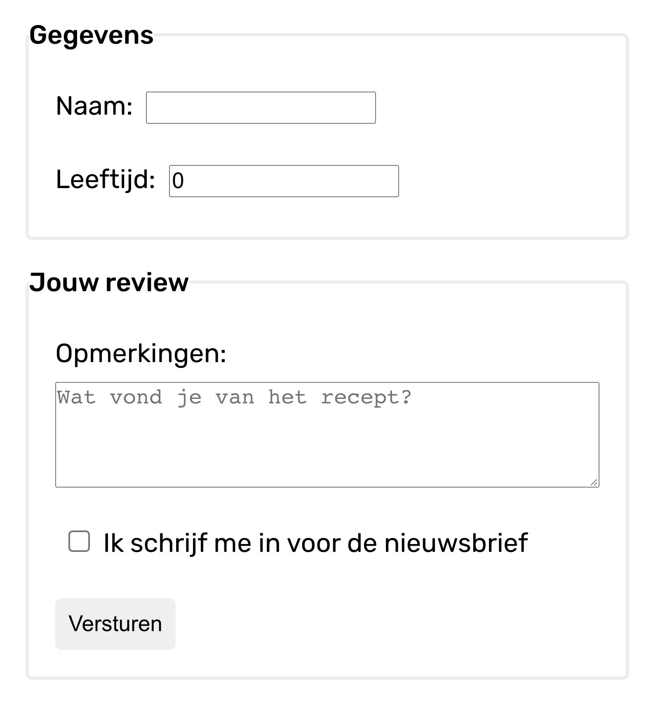

# Opdrachtbeschrijving

## Inleiding

Je gaat een React formulier maken met controlled components! Hiervoor maak je gebruik van de React useState hook.



In jouw formulier komen de volgende inputs te staan:

* _Naam_ - tekstveld
* _Leeftijd_ - getalveld
* _Opmerkingen_ - tekstareaveld
* _Inschrijven voor de nieuwsbrief_ - checkbox
* _Versturen-knop_ (van type `submit`)

Dit project is opgezet met behulp van [Create React App](https://github.com/facebook/create-react-app) (React versie 18.2.0).

## Applicatie starten

Als je het project gecloned hebt naar jouw locale machine, installeer je eerst de `node_modules` door het volgende
commando in de terminal te runnen:

```shell
npm install
```

Wanneer dit klaar is, kun je de applicatie starten met behulp van:

```shell
npm start
```

of gebruik de WebStorm knop (npm start). Open http://localhost:3000 om de pagina in de browser te bekijken. Begin met
het maken van wijzigingen in `src/App.js`: elke keer als je een bestand opslaat, zullen de wijzigingen te zien zijn op
de webpagina.

## Opdrachtbeschrijving

1. Maak alle invoervelden na en zorg dat dit controlled components zijn;
2. Zorg ervoor dat wanneer de gebruiker op de versturen-knop klikt, een functie genaamd `handleSubmit`" wordt
   aangeroepen die 'Verstuurd!' in de console logt. _Tip 1_: zet geen `onClick` eventlistener op de button, maar
   een `onSubmit` event-listener op het `<form>`-element! Deze wordt automatisch getriggerd wanneer er geklikt wordt op
   een button met `type=submit` in het formulier. _Tip 2_: Omdat de button in het formulier een `submit` button is, zal
   de pagina automatisch herladen wanneer je erop klikt. Zorg dat je dit voorkomt.
   _Tip_: lees [dit](https://www.robinwieruch.de/react-preventdefault) artikel over `preventDefault()` in React.
3. Probeer nu, in plaats van 'Verstuurd!', alle ingevulde waardes in de console te loggen wanneer de `handleSubmit`
   functie wordt aangeroepen.
4. **Bonus:** Make it look nice! 😍
5. **Bonus:** Snel klaar met deze opdracht en opzoek naar een extra uitdaging? Het is mogelijk (en in de parktijk ook
   gebruikelijk) om slechts één functie en één state variabele te gebruiken waarmee álle `onChange` listeners worden
   afgevangen. Als je hier mee wil experimenteren kun
   je [dit](https://www.pluralsight.com/guides/handling-multiple-inputs-with-single-onchange-handler-react)
   artikel gebruiken als leidraad. Lees het artikel grondig door. De antwoorden voor deze aanpak staan op de branch _
   uitwerkingen-bonus_.
